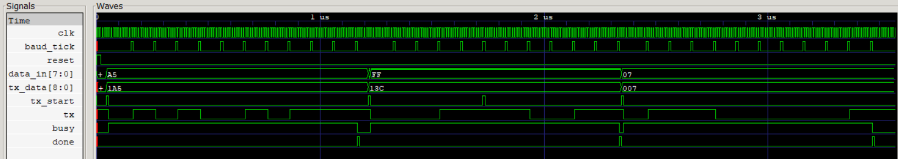

# UART in Verilog

This project implements a UART (Universal Asynchronous Receiver/Transmitter) transmitter and receiver in Verilog. 
This directory has 2 files: `uart_tx.v` for the transmitter and `uart_rx.v` for the receiver.

The design includes 2 testbench files to verify the functionality of the UART modules.
- `tb_uart_tx.v` tests the UART transmitter 
- `tb_baud_gen.v` tests the UART transmitter's internal baud rate generator

## To run the testbenches, you can use the following commands in your terminal:
>Requirements: You need to have Icarus Verilog and GTKWave installed on your system.
```
iverilog -o sim design.v tb.v    
vvp sim
gtkwave wave.vcd
```

Make sure to replace `design.v` and `tb.v` with the actual names of your design and testbench files.
### Note:
- The testbenches are designed to simulate the UART transmitter and receiver, and they will generate waveforms that can be viewed in GTKWave for analysis.
- Ensure that the baud rate and timing parameters in the testbenches are provided valid values for testing the UART modules effectively.

## GTKWave Waveform:
UART Transmitter Testbench Waveform



For more info:
- [UART Transmitter README](/UART_TX_README.md)
- [UART Receiver README](/UART_RX_README.md)