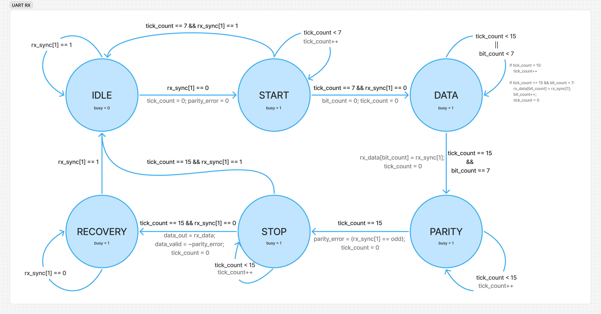

# UART Receiver (UART RX)

## Overview

This module implements a UART receiver in Verilog. It receives serial data using the 8O1 frame format and uses 16x oversampling to reliably sample the incoming data bits.

## Features

- 16x oversampling for data synchronization and noise rejection.
- Odd parity checking with error flagging (`parity_error`).
- Framing error recovery.
- Parameterized clock frequency and baud rate.

## FSM State Diagram



### State Machine

The receiver state machine operates on oversample ticks and consists of 6 states:

| State    | Function |
| -------- | -------- |
| IDLE     | Waits for the `rx` line to drop to `0`. |
| START    | Verifies the start bit. |
| DATA     | Reads the 8 data bits. |
| PARITY   | Reads the 9th bit and checks odd parity. |
| STOP     | Verifies the stop bit (`1`). Asserts `data_valid` if parity is correct, otherwise flags `parity_error`. If stop bit is missing, jumps to RECOVERY. |
| RECOVERY | Waits for the `rx` line to return high before returning to IDLE. |

## Ports Interface

### Inputs
- `clk`: System clock.
- `reset`: Synchronous active-high reset.
- `rx`: Serial receive line.

### Outputs
- `data_out [7:0]`: 8-bit received data.
- `data_valid`: Pulses high for one clock cycle when a valid, error-free byte is received.
- `busy`: High while receiving a byte.
- `parity_error`: High if a parity error is detected.

## Instantiation Example

```verilog
uart_rx #(
    .clk_freq(16_000_000),
    .baud_rate(9600)
) my_rx (
    .clk(clk),
    .reset(reset),
    .rx(rx_in),
    .data_out(received_byte),
    .data_valid(data_valid),
    .busy(rx_busy),
    .parity_error(parity_error)
);
```