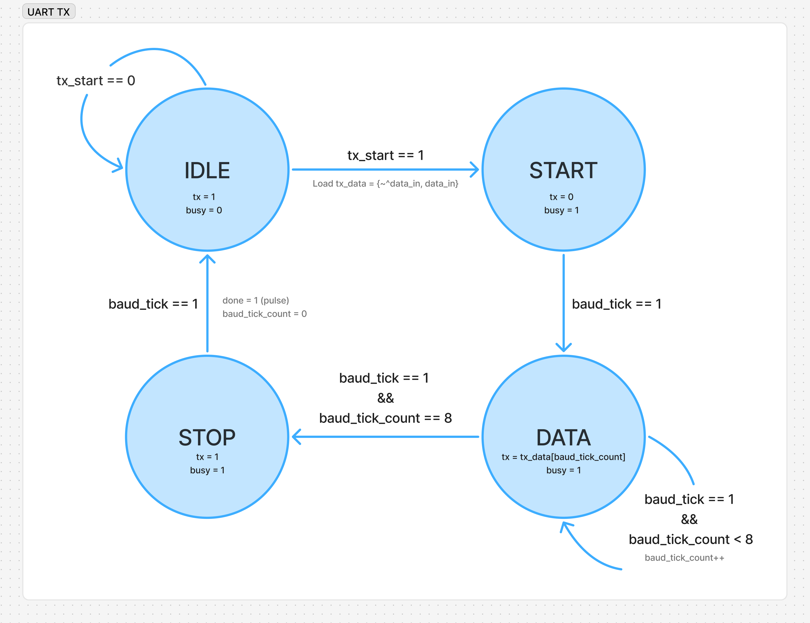

# UART Transmitter (UART TX)

## Overview

This module implements a parameterized UART transmitter in Verilog. It sends serial data using the 8O1 frame format (1 Start Bit, 8 Data Bits, 1 Odd Parity Bit, 1 Stop Bit). The design is fully synchronous and includes an internal baud-rate generator.

## Features

- Parameterized clock frequency and baud rate.
- FSM-based UART transmission.
- Internal baud tick generator.
- Generates a `busy` signal during transmission and a `done` pulse upon completion.
- LSB-first transmission.

## FSM State Diagram



### State Machine

The transmitter is controlled by a finite state machine with four states. The FSM transitions on baud ticks.

| State | Function                      |
| ----- | ----------------------------- |
| IDLE  | Wait for transmission request |
| START | Send start bit (0)            |
| DATA  | Send 8 data bits, then send the odd parity bit |
| STOP  | Send stop bit (1)             |

*Note: The odd parity bit is calculated using an XNOR reduction operator and appended as the 9th bit sent during the DATA state.*

## Ports Interface

### Inputs
- `clk`: System clock.
- `reset`: Synchronous active-high reset.
- `tx_start`: Pulse high to start transmission.
- `data_in [7:0]`: 8-bit parallel data to transmit.

### Outputs
- `tx`: Serial transmit line.
- `busy`: High while transmission is in progress.
- `done`: Pulses high for one clock cycle after successful frame transmission.

## Instantiation Example

```verilog
uart_tx #(
    .clk_freq(16_000_000), 
    .baud_rate(9600)
) my_tx (
    .clk(clk),
    .reset(reset),
    .tx_start(tx_start),
    .data_in(data_to_send),
    .tx(tx_out),
    .busy(tx_busy),
    .done(tx_done)
);
```